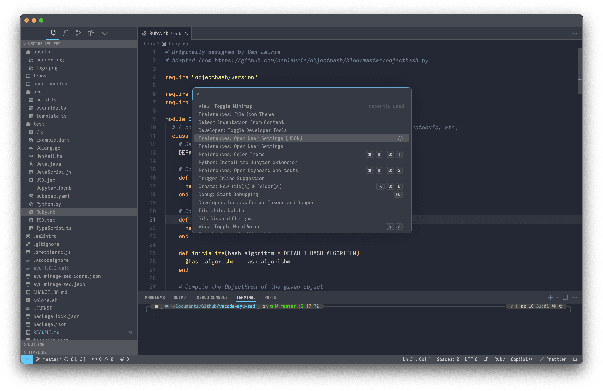

<p align="center">
  
</p>

# Ayu Mirage Zed theme for VSCode


Make VSCode look like Zed: a remake of Zed's Ayu mirage theme for VSCode. Also includes file icons and APC custom CSS for Zed-like interface (modifies command palette & title bar)!

> Source from: [dempfi/ayu](https://github.com/dempfi/ayu)

> Forked from: [ayu-theme/vscode-ayu](https://github.com/ayu-theme/vscode-ayu)

> Icons from: [zed-industries/zed](https://github.com/zed-industries/zed/tree/main/assets/icons/file_icons)

> Note that this isn't a theme maintained by the original [Ayu theme](https://github.com/dempfi/ayu) author or the vscode fork [vscode-ayu](https://github.com/dempfi/ayu) so please report issues related to this theme here.

## Gallery


_Zed-like centered command palette & more custom css_

_No open editors_

## Install

Install the extension from the VS Code Marketplace.

### Theme setup

Simply go to `Preferences > Color Theme > Ayu Mirage Zed`.

### File Icon setup

If you want to setup File Icon, then go to `Preferences > File Icon Theme > Ayu Mirage Zed`.

### Zed Font

If you want to use Zed's font, download them from [zed-fonts](https://github.com/zed-industries/zed-fonts) and proceed with the next section.

### APC custom CSS

Install & setup the [APC Customize UI++](https://marketplace.visualstudio.com/items?itemName=drcika.apc-extension) extension, then paste the following into your `settings.json`. (Note: not tested on Windows.)

```json
"apc.electron": {
    "titleBarStyle": "hiddenInset",
    "trafficLightPosition": {
      "x": 7,
      "y": 5
    }
  },
  "editor.fontFamily": "'Zed Mono', 'Courier New', monospace",
  "apc.font.family": "Zed Sans",
  "apc.stylesheet": {
    ".quick-input-widget": {
      "position": "absolute !important",
      "top": "200px !important",
      "left": "50%",
      "border-radius": "10px",
      "border": "1px solid var(--vscode-textSeparator-foreground) !important",
      "box-shadow": "0 0 60px 0 rgba(0,0,0,0.2) !important"
    },
    // left title bar (controls)
    ".titlebar-left": {
      "max-width": "70px !important"
    },
    // center title bar
    ".titlebar-center": {
      "margin": "0 !important"
    },
    // arrow buttons
    ".action-item.menu-entry": {
      "display": "none !important"
    },
    // whole title bar command center container
    ".action-item.command-center-center": {
      "background-color": "transparent !important",
      "border": "none !important",
      "width": "fit-content !important"
    },
    // field
    ".quick-input-header": {
      "padding": "0 !important"
    },
    // input element container
    ".monaco-inputbox": {
      "border-radius": "10px 10px 0 0 !important"
    },
    // actual input element
    ".monaco-inputbox>.ibwrapper>.input, .monaco-inputbox>.ibwrapper>.mirror": {
      "padding": "8px 10px !important"
    },
    // list of results
    ".quick-input-list > .monaco-list > .monaco-scrollable-element": {
      "padding": "2px !important"
    },
    // status bar set height
    "div:has(> .statusbar)": {
      "height": "25px !important",
      "top": "auto !important",
      "bottom": "0 !important"
    },
    ".statusbar": {
      "height": "25px !important"
    },
    // hides search icon
    ".codicon.codicon-search.search-icon": {
      "display": "none !important"
    },
    // empty editor background
    ".editor-group-container.empty.active": {
      "background-color": "var(--vscode-statusBar-background)"
    },
    "div:has(> .tabs-and-actions-container.tabs-border-bottom.empty)": {
      "background-color": "var(--vscode-statusBar-background) !important"
    }
  },
```

## Screenshots

## Development

Setup

```shell
npm install # install dependencies
npm run build # build the theme
```

Run development: Go to build.ts and preess F5. Changes to the theme will only apply when you run the build command, unless you edit the json files directly.

Build package

```shell
npm run package
```

Install package locally

```shell
code --install-extension ayu-mirage-zed-1.0.0.vsix
```
